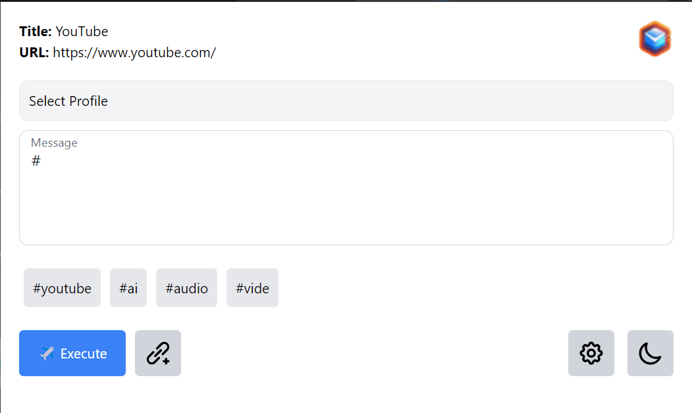
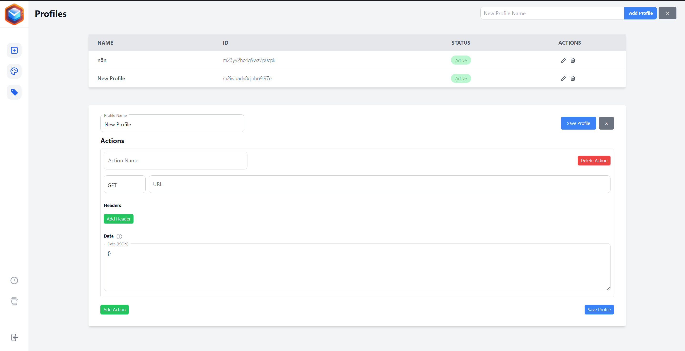
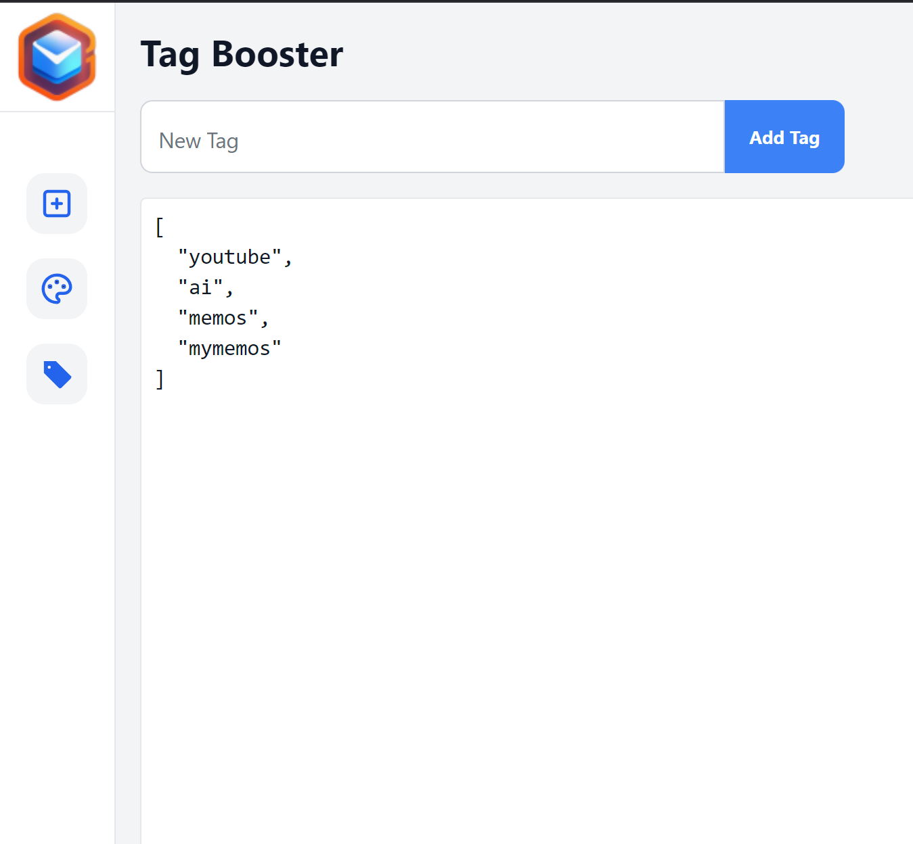
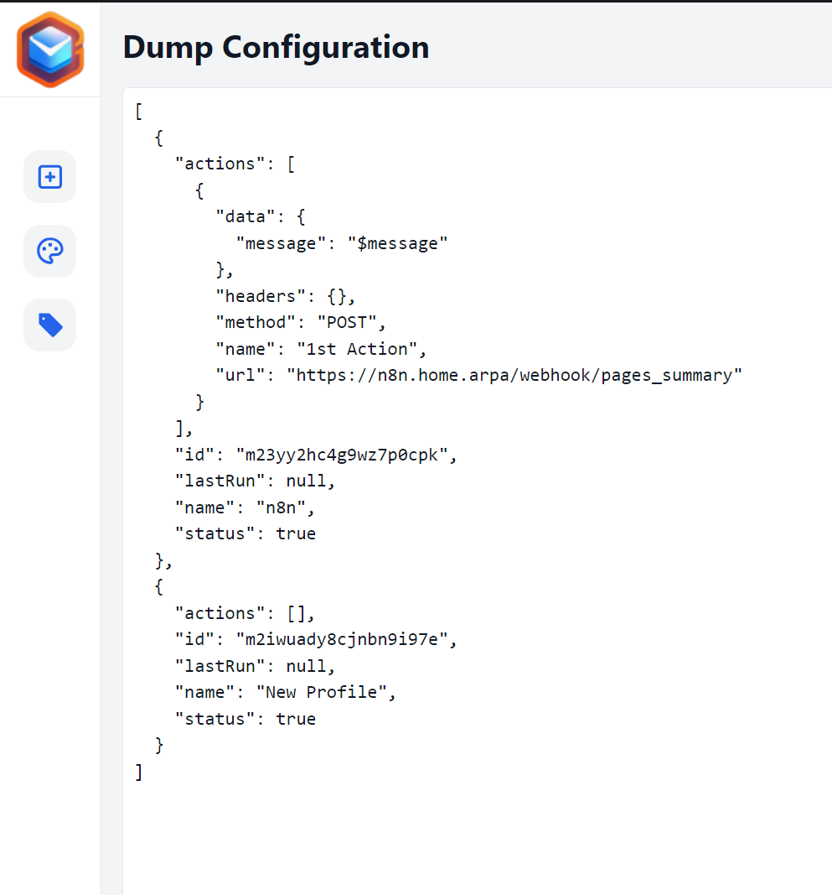

<h1> Chrome Extension Emissary</h1>

<h5>
🔥🔥 Please Note: 🔥🔥 
This estension was developed in 100% by AI.  Code can be messy... but extension do what it was design for.
</h5>

## Table of Contents

- [Intro](#intro)
- [Features](#features)
- [Usage](#usage)
- [Screenshots](#screenshots)

## Intro 
Web Clipper allows you to send messages to your N8N instance or Discord or any othere APP via predefined WebHook profiles.

## Features 
- Profiles for Webhooks
- Tag Booster
- Copy/Pass YAML Config

## Usage 
- go to plugin settings and define your profile
- set profile and try to send message

## Screenshots 
- Main view

- Profiles

- Tag Booster

- Copy/Pass YAML Config

